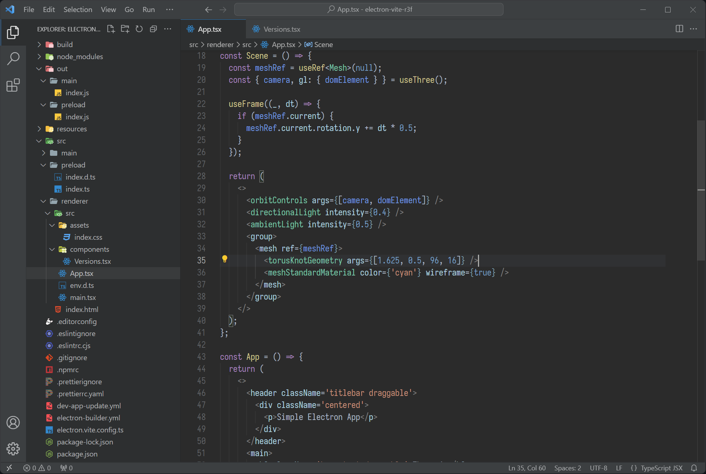
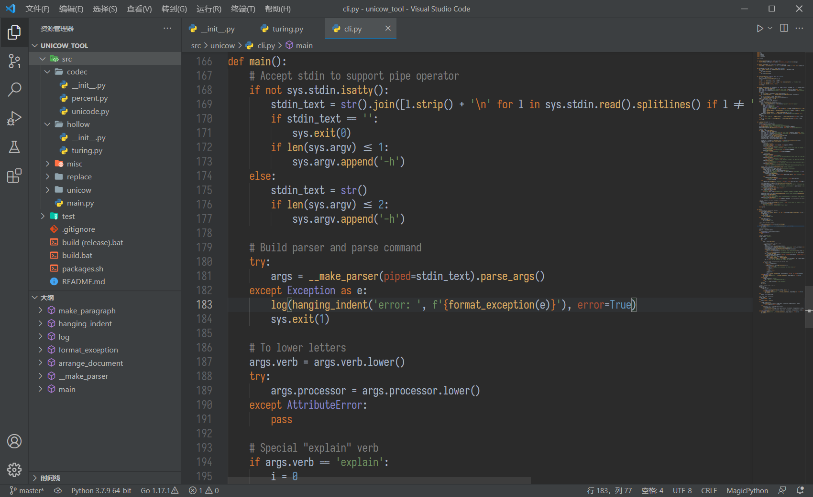

# Dark Plus Darcula Theme for Visual Studio Code

A hybrid of the default "Dark Plus" and the "Darcula" theme of JetBrains IDEs, in two variants:

1. **Dark Plus Darcula (default)**: a theme that tries to keep the flavor (and some of the good things) of Dark Plus, while introducing JetBrains' GUI palette; syntax colors are picked & fine-tuned with care from that of Dark Plus. Designed for folks obsessed with the defaults like me :)

    

2. **Dark Plus Darcula (IntelliJ imitation)**: this one tries its best to imitate the look and feel of JetBrains', both the GUI and the syntax highlighting. However, there *are* limitations due to the differences between two IDEs (and my own lack of techniques): some of the coloring patterns, which I deliberately choose to abandon, must be achieved at the price of compatibility with the most variety of languages. This one is designed for real JetBrains fans ;)

    

